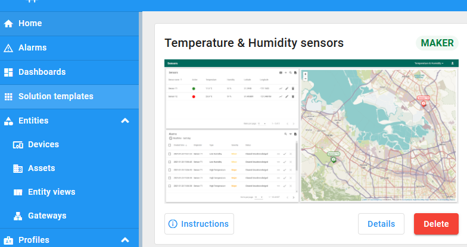
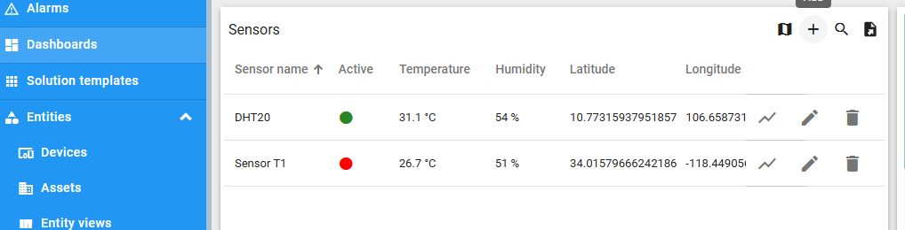
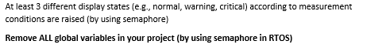

Đã làm:

1. thêm con AI - train với 2 labels:
   0 ảnh hưởng xe nhiệt độ >= 30 độ ẩm > 70
   1 Ngập/Mưa nhiệt độ <= 27 độ ẩm >= 80

2. neoledblinky:
   3 trạng thái

3. thêm quạt + máy bơm nước + 4 led rgb

4. upload data lên core iot

5. Mutex các dữ liệu

Cách Chạy bài:
Clone src code này về -> check out ra 1 nhánh mới -> làm xong thì commit -> pull request.

Sửa:
file global.cpp thay đổi 3 cái này
String WIFI_SSID = "NgHao";
String WIFI_PASS = "nguyenhao110403";
String CORE_IOT_TOKEN = "g8antxzs2o39jyb8xtgx"; //tên device

KHIÊM:
task 6 thì tui làm cũng có vẻ là xong rồi (còn thiếu 1 xíu phần todo). giờ ô coi lại task 1 + task 6 xem có thêm bớt hay gì nữa ko thôi.
tui đang tính là tạo thêm 1 device nữa (đặt ở nơi khác, xong dựa vào gateway để gửi dữ liệu lên core iot,....)
Còn về core iot thì ô phải ấn vào solution template -> chọn cái dash board này.

sau đó ấn dấu + để thêm device rồi mới copy access token device đó vào code mình thì là chạy đc

Vậy giờ việc của ô là:

- độ thêm cho task 1+6
- viết rp
- Làm thêm task 3 ()
  Kiểm tra lại các biến global đã chạy đúng chưa và xóa nó đi (glob_temperature/humidity), có thể sử dụng queue hay là cái gì đó tránh race condition là đc
  Tạo 3 different display states cho cái lcd
- 

ĐẠT:
Phần Đạt thì nhìn có vẻ dễ nhưng thật ra khá khoai =)))).

Việc của Đạt là:

- Kết nối dữ liệu từ con esp lên trang web
- Lưu dữ liệu ng dùng nhập lên trang web ( chưa test, có rồi thôi)
